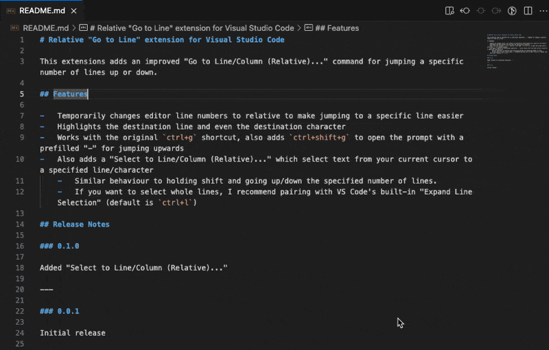

# Relative "Go to Line" extension for Visual Studio Code

This extensions adds an improved "Go to Line/Column (Relative)..." command for jumping a specific number of lines up or down.

## Features

-   Temporarily changes editor line numbers to relative to make jumping to a specific line easier
-   Highlights the destination line and even the destination character
-   Works with the original `ctrl+g` shortcut, also adds `ctrl+shift+g` to open the prompt with a prefilled "-" for jumping upwards
-   Also adds a "Select to Line/Column (Relative)..." which select text from your current cursor to a specified line/character
    -   Similar behaviour to holding shift and going up/down the specified number of lines.
    -   If you want to select whole lines, I recommend pairing with VS Code's built-in "Expand Line Selection" (default is `ctrl+l`)

## Release Notes

### 0.1.0

Added "Select to Line/Column (Relative)..."

---

### 0.0.1

Initial release
